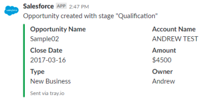
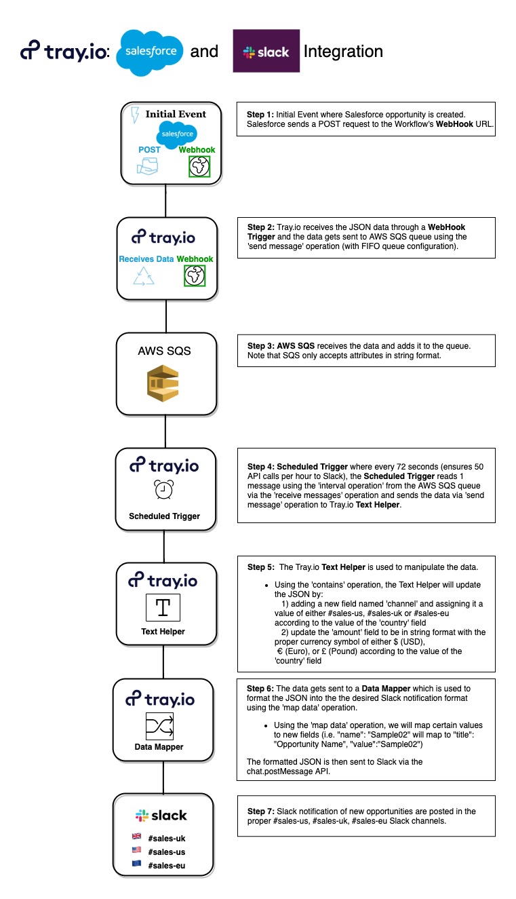
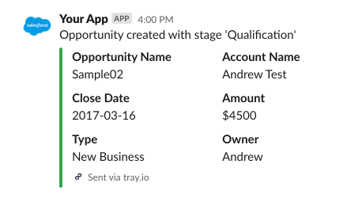

# Tray.io: Salesforce & Slack Integration Proposal


Table of Contents
=================

  * [Client Requirements](#client-requirements)
    * [Specifics](#specifics)
  * [Integration Solution](#integration-solution)
    * [Flowchart Diagram](#flowchart-diagram)
    * [Overview](#overview)
    * [Workflow Steps](#workflow-steps)
    * [Slack Notification](#slack-notification)
    * [Security](#security)
  * [Data Object References](#data-object-references)
    * [Salesforce data object](#Salesforce-data-object)
    * [Formatted Slack Message](#formatted-slack-message)
  * [Outstanding Questions](#outstanding-questions)
  * [References](#documentation-references)

Client Requirements
===================
The customer utilizes Salesforce CRM and would like to utilize the Tray.io platform to post notifications in Slack channels when new Salesforce "opportunities" are created by sales represenatitives.

Specifics
---------
1. When a Salesforce "opportunity" is created, a notification message is posted to a Slack channel
2. The notification message posted to Slack will be in the following format:

    

3. The customer has sales teams globally (United States, United Kingdom & Europe). The message should be posted into the Slack channel relevant to the `country` field selected when creating the "opportunity":
 * US: #sales-us
 * UK: #sales-uk
 * EU: #sales-eu
4. The customer's Slack instance supports 50 API calls per hour, we want to ensure that this integration does not exceed that limit and result in notification messages that are not posted to Slack.

Integration Solution
====================
Flowchart Diagram
-----------------


Overview
--------
We will utilize the following features of the Tray.io platform to create this integration:
1. Tray.io [WebHook Trigger](https://tray.io/documentation/platform/connectors/webhook-trigger/)
2. Tray.io [AWS SQS](https://tray.io/documentation/platform/connectors/docs/service/aws-sqs/)
3. Tray.io [Scheluded Trigger](https://tray.io/documentation/platform/connectors/docs/triggers/scheduled-trigger/)
4. Tray.io [Text Helper](https://tray.io/documentation/platform/connectors/docs/helpers/text-helper/)
5. Tray.io [Data Mapper](https://tray.io/documentation/platform/connectors/docs/core/data-mapper/)
6. Tray.io [Slack](https://tray.io/documentation/platform/connectors/docs/service/slack/)

Workflow Steps
--------------
1. Configure the Webhook in your service. (See [guide](https://tray.io/documentation/platform/connectors/webhook-trigger/) for initial setup).
2. POST JSON object to the Tray.io Webhook URL (See [Salesforce Data Object](#salesforce-data-object)).
3. Tray.io `Webhook Trigger` recieves the message and passes it to `AWS SQS` using the `Send Message` operation (with FIFO queue configuration).
4. `AWS SQS` receives the data and adds it to the queue. Note that SQS only accepts attributes in string format.
5. Every 72 seconds (ensures 50 API calls per hour to Slack), the `Scheduled Trigger` helper reads 1 message (`Interval` operation) from the `AWS SQS` queue (`Recieve Messages` operation) and sends the data to the `Text Helper`.
6. The `Text Helper` will update the data using the `Contains` operation to: 
    * Add a new field named `channel` and assign it a value of either #sales-us, #sales-uk or #sales-eu according to the value of the `country` field                         
    * Update the `amount` field to be in string format with the proper currency symbol of either $ (USD), € (Euro), or £ (Pound), according to the value of the `country` field
    * The data than gets passed to the `Data Mapper` helper
7. The `Data Mapper` formats the JSON into the desired Slack notification format using the `Map Data` operation. 

    For example: 
    
    ```
        "name": "Sample02"
    ```
    gets mapped within the "attachments" and "fields" array
    ```
        "title": "Opportunity Name",
        "value": "Sample02",
    ```
    (See [Formatted Slack Message](#formatted-slack-message)). Once the data has been formatted, a POST request is made to Slack via chat.postMessage API (See [Posting a Slack Message](https://api.slack.com/methods/chat.postMessage)).

8. Slack notifications of new opportunities are posted in the proper #sales-us, #sales-uk, #sales-eu Slack Channels.


Slack Notification
------------------

Slack has a [message builder](https://api.slack.com/docs/messages/builder?msg=%7B%22text%22%3A%22I%20am%20a%20test%20message%22%2C%22attachments%22%3A%5B%7B%22text%22%3A%22And%20here%E2%80%99s%20an%20attachment!%22%7D%5D%7D) tool which takes JSON and provides a preview of the message. Testing the [Formatted Slack Message](#formatted-slack-message) returns the following Slack Notification. 



Security
--------
1. Tray.io recommends the customer utilizing a CSRF token to perform authentication with the Tray.io Webhook domain. Please post to the Tray.io webhook URL with a `x-csrf-token` header.

Data Object References
======================
Salesforce Data Object
----------------------
```
{
  "id": "0065800000BwzJt",
  "name": "Sample02",
  "status": "Qualification",
  "account": "Andrew Test",
  "close_date": "2017-03-16",
  "type": "New Business",
  "country": "UK", // can also be US or EU
  "owner_name": "Andrew",
  "owner_email": "andrew@tray.io",
  "amount": 4500
}
```

Formatted Slack Message
-----------------------
```
{
  "token": "Put Your Token in This Field",
  "channel": "#sales-us",
  "icon_url": "https://cdn.iconscout.com/icon/free/png-512/salesforce-3-569548.png",
  "attachments": [
        {
            "fallback": "New Salesforce Opportunity",
            "color": "#36a64f",
            "pretext": "Opportunity created with stage 'Qualification'",
            "fields": [
                {
                    "title": "Opportunity Name",
                    "value": "Sample02",
                    "short": true
                },
                {
                    "title": "Account Name",
                    "value": "ANDREW TEST",
                    "short": true
                },
                {
                    "title": "Close Date",
                    "value": "2017-03-16",
                    "short": true
                },
                {
                    "title": "Amount",
                    "value": "$4500",
                    "short": true
                },
                {
                    "title": "Type",
                    "value": "New Business",
                    "short": true
                },
                {
                    "title": "Owner",
                    "value": "Andrew",
                    "short": true
                }
            ],
            "footer": "Sent via tray.io",
            "footer_icon": "https://avatars.slack-edge.com/2019-01-14/522738550513_06c16bb4fbcaaf1f7011_512.png"

        }
    ]
}
```     

Outstanding Questions
=====================
1. What is the expected behavior of the integration if the `country` field does not match the list in the specification?
2. Are there any competing API integrations on the client's Slack workspace that may reduce the number of API calls this particular integration can make on an hourly basis?
3. Would the client want to restrict notifications to be sent only during working hours? 
4. Can the client please provide us with an estimate of the volume and frequency that oppertunities are created? Using this data we may recommend another approach to handle the Slack API call limitation.
5. Tray.io provides a native Salesforce connector where workflows can be triggered on the creation of `Lead` records. Is the client interested in taking advantage of this feature?
6. What happens when a sales representative closes a deal? Would the client be interested in an integration for when a deal is made?

Documentation References
========================
* [Tray Workflow Overview](https://tray.io/documentation/platform/overview/)
  * [Webhook Trigger](https://tray.io/documentation/platform/connectors/webhook-trigger/#)
  * [AWS SQS](https://tray.io/documentation/platform/connectors/docs/service/aws-sqs/)
  * [Scheluded Trigger](https://tray.io/documentation/platform/connectors/docs/triggers/scheduled-trigger/)
  * [Text Helper](https://tray.io/documentation/platform/connectors/docs/helpers/text-helper/)
  * [Data Mapper](https://tray.io/documentation/platform/connectors/docs/core/data-mapper/)
  * [Slack](https://tray.io/documentation/platform/connectors/docs/service/slack/)
* Slack Documentation:
  * [Slack API](https://api.slack.com/)
  * [Posting a Slack Message (chat.postMessage)](https://api.slack.com/methods/chat.postMessage)
  * [Building Message Attachment](https://api.slack.com/docs/message-attachments)
  * [Testing Message Attachment](https://api.slack.com/docs/messages/builder?msg=%7B%22channel%22%3A%22%23sales-us%22%2C%22icon_url%22%3A%22https%3A%2F%2Fcdn.iconscout.com%2Ficon%2Ffree%2Fpng-512%2Fsalesforce-3-569548.png%22%2C%22attachments%22%3A%5B%7B%22fallback%22%3A%22New%20Salesforce%20Opportunity%22%2C%22color%22%3A%22%2336a64f%22%2C%22pretext%22%3A%22Opportunity%20created%20with%20stage%20%27Qualification%27%22%2C%22fields%22%3A%5B%7B%22title%22%3A%22Opportunity%20Name%22%2C%22value%22%3A%22Sample02%22%2C%22short%22%3Atrue%7D%2C%7B%22title%22%3A%22Account%20Name%22%2C%22value%22%3A%22Andrew%20Test%22%2C%22short%22%3Atrue%7D%2C%7B%22title%22%3A%22Close%20Date%22%2C%22value%22%3A%222017-03-16%22%2C%22short%22%3Atrue%7D%2C%7B%22title%22%3A%22Amount%22%2C%22value%22%3A%22%244500%22%2C%22short%22%3Atrue%7D%2C%7B%22title%22%3A%22Type%22%2C%22value%22%3A%22New%20Business%22%2C%22short%22%3Atrue%7D%2C%7B%22title%22%3A%22Owner%22%2C%22value%22%3A%22Andrew%22%2C%22short%22%3Atrue%7D%5D%2C%22footer%22%3A%22Sent%20via%20tray.io%22%2C%22footer_icon%22%3A%22https%3A%2F%2Favatars.slack-edge.com%2F2019-01-14%2F522738550513_06c16bb4fbcaaf1f7011_512.png%22%7D%5D%7D)
 
